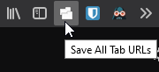
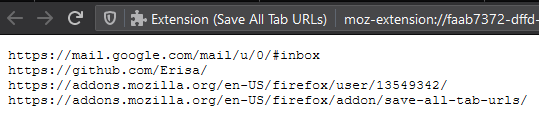

# Save All Tab URLs

[Download for Firefox](https://addons.mozilla.org/firefox/addon/save-all-tab-urls/) | [Download for Chrome](https://chrome.google.com/webstore/detail/save-all-tab-urls/bgjfbcjoaghcfdhnnnnaofkjbnelkkcm)

This extension simply adds a button to the menu bar of your browser which opens a page containg a list of all the open tab URLs.

## Why?
Because I wanted it, and so I made it. The idea for this extension was born from when I needed to save all open URLs for further research. Can be used for collecting lists of sources among other things.

## Features
- Shows a list of open URLs.
- Export list to a file.

## Screenshots
The menu button:  

The page that opens:  

## Downloads

- Only Firefox and Chrome are officially supported. Other Chromium-based browsers will likely work by association, but they won't be tested before a new version release.  
  - Firefox for Android will work and is supported, but not as extensively tested. Feel free to report any issues with the extension on Android.
  - Other Firefox-based browsers will only work if they support WebExtensions. This includes WaterFox, but not Pale Moon. These browsers are not tested or supported, if it works then it works.
- Browsers based on other engines (e.g. Safari, Internet Explorer, Edge Legacy) are not supported and will never be supported by me.  

### Mozilla Firefox (Desktop/Android)
Grab a signed XPI from the official [Firefox Add-ons](https://addons.mozilla.org/firefox/addon/save-all-tab-urls/) website, or from the [Releases](https://github.com/Erisa/save-all-tab-urls/releases) section.

### Google Chrome, Chromium, Opera, Vivaldi, Brave
Grab a signed CRX from the official [Chrome Webstore](https://chrome.google.com/webstore/detail/save-all-tab-urls/bgjfbcjoaghcfdhnnnnaofkjbnelkkcm), or from the [Releases](https://github.com/Erisa/save-all-tab-urls/releases) section.

### Microsoft Edge (Chromium)
Grab a signed CRX from the official [Microsoft Edge Addons Store](https://microsoftedge.microsoft.com/addons/detail/djbejkhoeddlhcimemncgmmfbdkifkim) or from the [Releases](https://github.com/Erisa/save-all-tab-urls/releases) section.

### Microsoft Edge Legacy (EdgeHTML, UWP)
Not supported, never will be due to the release of [Edge powered by Chromium](https://microsoft.com/edge).

## Planned changes
- Support for importing previously saved lists.
- Better mobile view.

## Credits
- [Matthew Baa](https://addons.mozilla.org/en-US/firefox/user/13453468/).
